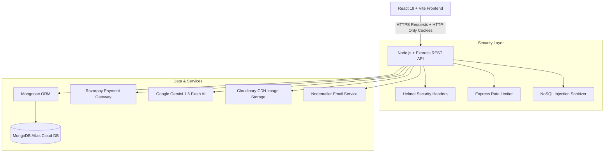
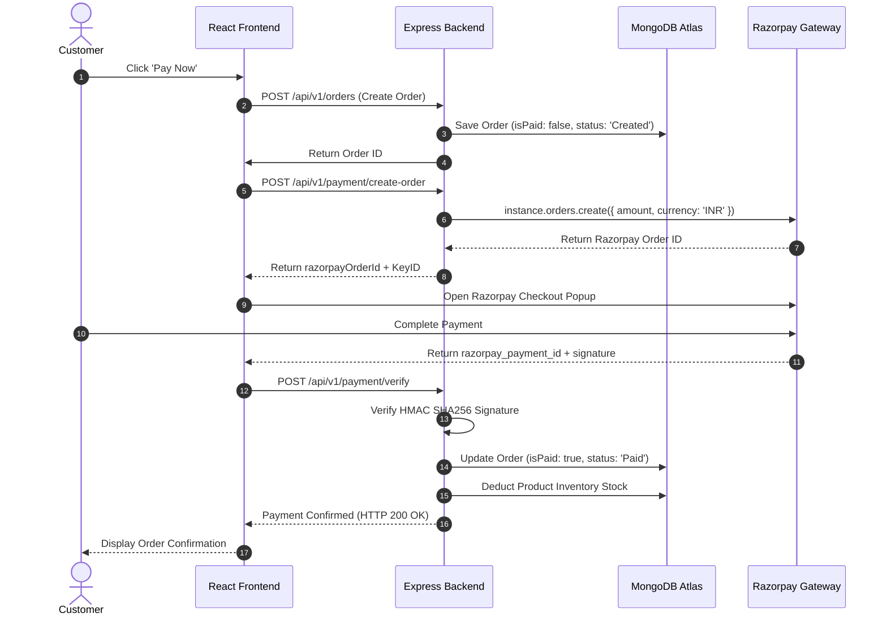

# 📐 SmartCart AI — System Architecture & Data Flow

```mermaid
graph TD
    Client[React 19 + Vite Frontend] -->|HTTPS Requests + HTTP-Only Cookies| Express[Node.js + Express REST API]
    
    subgraph Security Layer
        Express --> Helmet[Helmet Security Headers]
        Express --> RateLimiter[Express Rate Limiter]
        Express --> MongoSanitize[NoSQL Injection Sanitizer]
    end

    subgraph Data & Services
        Express --> Mongoose[Mongoose ORM]
        Mongoose --> Atlas[(MongoDB Atlas Cloud DB)]
        
        Express --> Razorpay[Razorpay Payment Gateway]
        Express --> Gemini[Google Gemini 1.5 Flash AI]
        Express --> Cloudinary[Cloudinary CDN Image Storage]
        Express --> SMTP[Nodemailer Email Service]
    end
```

---

## 🔒 Razorpay Payment Lifecycle

```mermaid
sequenceDiagram
    autonumber
    actor Customer
    participant React as React Frontend
    participant Express as Express Backend
    participant DB as MongoDB Atlas
    participant RZP as Razorpay Gateway

    Customer->>React: Click 'Pay Now'
    React->>Express: POST /api/v1/orders (Create Order)
    Express->>DB: Save Order (isPaid: false, status: 'Created')
    Express->>React: Return Order ID
    React->>Express: POST /api/v1/payment/create-order
    Express->>RZP: instance.orders.create({ amount, currency: 'INR' })
    RZP-->>Express: Return Razorpay Order ID
    Express-->>React: Return razorpayOrderId + KeyID
    React->>RZP: Open Razorpay Checkout Popup
    Customer->>RZP: Complete Payment
    RZP-->>React: Return razorpay_payment_id + signature
    React->>Express: POST /api/v1/payment/verify
    Express->>Express: Verify HMAC SHA256 Signature
    Express->>DB: Update Order (isPaid: true, status: 'Paid')
    Express->>DB: Deduct Product Inventory Stock
    Express-->>React: Payment Confirmed (HTTP 200 OK)
    React-->>Customer: Display Order Confirmation
```
